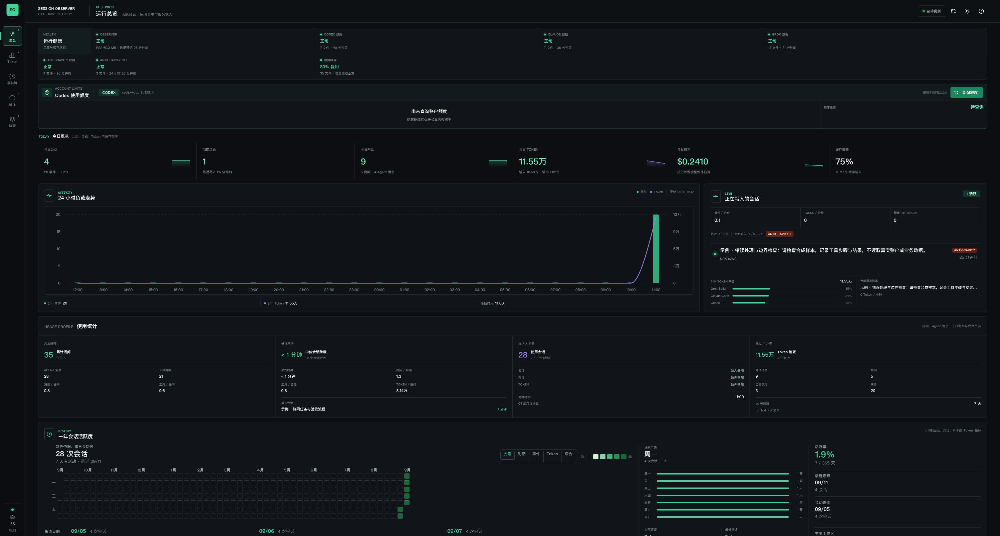
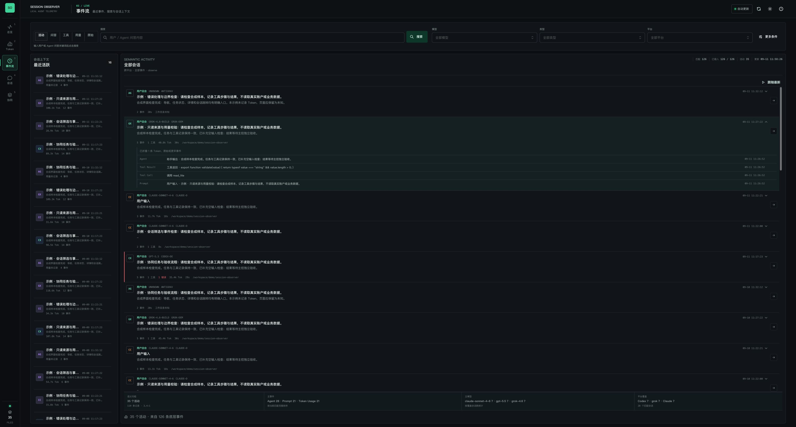
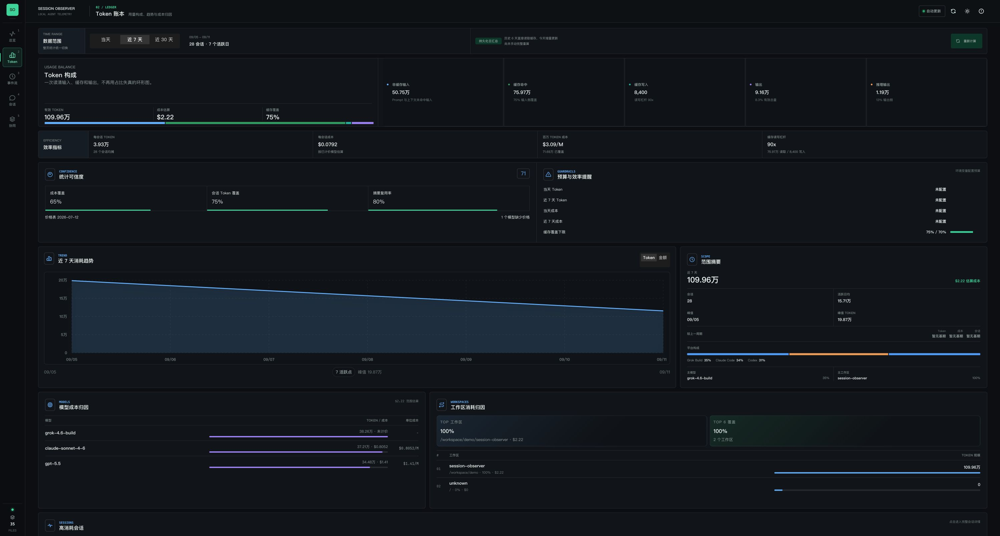
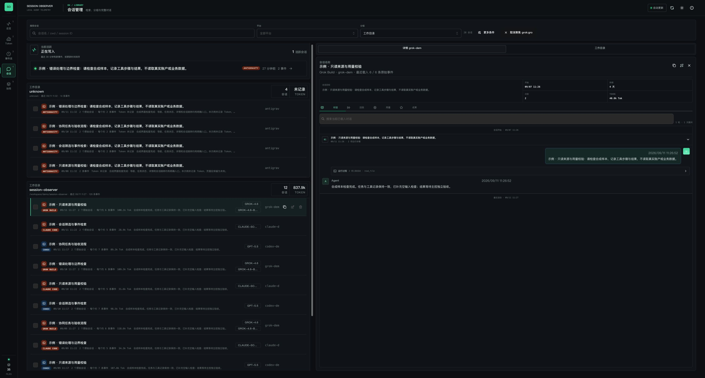
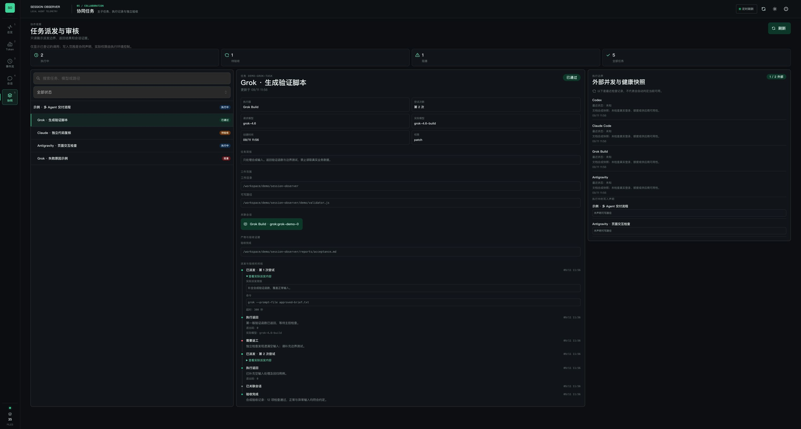

# Session Observer

本 fork 增加 **Grok Build** 和 **Antigravity 桌面版 / CLI** 本地会话的只读支持。详见[支持范围、配置与限制](docs/grok-antigravity.md)。保留原项目的 Codex、Claude Code 能力。

新增 **协同页面与本地调用记录器**：展示父子任务、实际派发简报、返回、退回重做、独立验收、执行器健康快照和写入声明。详见[协同工作流与 CLI 用法](docs/collaboration.md)。仅追踪通过记录器登记的调用；记录器不提供权限沙箱，也不会自动拦截所有 Agent 应用。

**面向 Codex、Claude Code、Grok Build 与 Antigravity 的本地会话与协同观测工作台。** 在同一界面查看已记录的指令、回复、工具、用量，以及显式登记的任务派发和验收流程。会话查看在本机完成，各平台的支持范围和缺失字段说明见下文。

[](https://github.com/wuchenchenyo/session-observer/actions/workflows/ci.yml)
[](LICENSE)
[](package.json)
[](package.json)
[](#隐私模型)

[English](README.md)



Session Observer 面向同时使用多个本地编码 Agent 的开发者，重点解决这些实际问题：

- 当前有哪些会话仍在写入，最近发生了什么？
- 用户问了什么、Agent 如何回答，中间执行了哪些工具？
- 输入、缓存读取、缓存写入、输出、推理 Token 和估算成本分别来自哪里？
- 哪些模型、工作区、文件和命令占用了主要资源？
- 面对数百 MB 的会话文件，能否不创建庞大的全量事件索引？
- 任务派给了哪个 Agent、返回了什么，主控是否已经验收或要求重做？

## 30 秒启动

```bash
npm install
./manage.sh start
./manage.sh open
```

默认地址为 [http://127.0.0.1:8787](http://127.0.0.1:8787)，不需要注册账号或部署外部数据库。

`manage.sh` 会按需构建 Vite 前端，并使用受约束的 Node 堆参数启动服务。仅调试前端时可以运行 `npm run dev`。

## 核心工作面

| 页面 | 主要用途 |
| --- | --- |
| **运行总览** | 服务与数据源健康、RSS 与 Heap、今日会话和对话、24 小时事件与 Token 负载、正在写入的会话、使用节奏和工作区集中度 |
| **Token 账本** | 非缓存输入、缓存命中、缓存写入、输出、推理输出、估算成本、效率指标、趋势与预测、模型归因、工作区归因和高成本会话 |
| **事件流** | 按用户回合归组的语义活动、问答/工具/用量/原始视图、按钮触发搜索、筛选、高亮、实时跟随/暂停，以及跳转到会话详情 |
| **会话管理** | 活跃会话、工作区分组、目录树、完整会话统计、开始与最近时间、可折叠对话、活动、用量、文件/工具、命令、错误、上下文压缩和原始诊断 |
| **协同任务** | 父子任务树、派发/返回/验收时间线、关联会话、健康快照、并发与写入声明检查 |

会话工作台同时支持执行回放、两会话对比和本地成果标注。对比使用紧凑摘要，不需要载入完整会话正文。Token 页面还会显示成本覆盖率、会话 Token 覆盖率、价格表版本和预算提醒。

## 多 Agent 协同工作流

点击侧栏 **协同**（快捷键 **5**），查看四类执行器已登记的协作任务。页面每 10 秒刷新，也支持手动刷新，并适配桌面与窄屏布局。

| 功能 | 可以看到或检查什么 |
| --- | --- |
| 父子任务树 | 明确的任务 ID、父任务 ID、执行器、工作目录、写入路径声明，以及搜索和状态筛选 |
| 实际派发内容 | 派发简报、命令摘要、超时设置、请求模型，以及可获取的实际模型元数据 |
| 返回与重做时间线 | 结果摘要、尝试次数、退回原因，以及认证、额度、权限、网络、超时等失败类别 |
| 独立验收 | 程序成功返回先进入 `awaiting_review`；主控附证据登记 `passed`，或要求重做 |
| 关联会话跳转 | 打开已明确绑定的 Codex、Claude、Grok、Antigravity 会话；不按时间或目录猜测关系 |
| 执行器健康快照 | 最近记录的状态、能力范围、原因和检查时间；程序返回成功不等于供应商当前可用 |
| 并发与写入冲突检查 | 同一账本最多 2 个外部任务同时执行；所有执行中任务（包括 Codex）的写入路径声明不能重叠 |
| 本地调用记录器 | JSONL 追加账本、私有目录/文件权限、有界内容采集、常见秘密脱敏，以及只读的协同 HTTP 接口 |

```text
Codex 创建主任务并分派子任务
  → 执行中 → 待验收 → 已通过（附独立验收证据）
                    → 退回重做 → 再次执行（尝试次数增加）
```

存在未完成子任务时，父任务不能提前通过。任务记录不提供操作系统沙箱，也不授予权限。仅追踪进入同一账本的调用，历史会话不会自动补成派发关系；健康快照不会触发后台探测，失败也不会自动重试。

### 调用记录入口

在仓库根目录查看记录器用法和已有任务：

```bash
node server/collaboration-cli.js --help
node server/collaboration-cli.js list
```

CLI 提供 `create`、`run`、`event`、`health`、`list`、`show`。其中 `run` 直接启动明确指定的程序，不经过 shell，并记录派发和返回。[完整示例](docs/collaboration.md#最小工作流) 使用合成本地命令演示创建任务与独立验收，不调用供应商服务。

准备好已获准共享的简报并创建父任务后，可使用附带的 Claude 复核入口自动创建子任务、记录派发和返回：

```bash
python3 examples/claude-review.py \
  --brief /absolute/approved-brief.txt \
  --out /absolute/new-review.txt \
  --observer-parent EXISTING_PARENT_TASK_ID \
  --timeout 300
```

此命令会实际调用已安装的 Claude CLI，通过既有订阅登录发送简报。入口禁用工具、Chrome 和会话持久化，不启用 API/provider 回退。返回后仍等待主控独立验收；没有持久会话时，保留调用记录，不生成虚假的 Session 链接。

Grok、Antigravity CLI 可将已验证的调用入口交给通用 runner。GUI 操作需要显式登记派发和返回事件，Observer 不会自动拦截所有 Agent 应用。字段、Session ID、目录配置、脱敏限制和记录器崩溃后的恢复方法见[协同使用说明](docs/collaboration.md)。

## 设计重点

### 默认看语义活动，而不是底层日志噪声

事件流会把一个用户回合、Agent 回复、工具调用、Token 快照、模型、耗时和错误归并成一个可展开活动。原始视图仍用于排查，但正常使用时不再被内部记录淹没。

搜索通过按钮显式触发，只匹配用户与 Agent 的问答内容，不会因为内部元数据、路径或 Token 记录产生大量无效结果。

### 一个统一的会话工作台

从事件流或活跃会话跳转时，都会进入同一个详情工作台。完整事件数和 Token 总量来自稳定摘要，对话内容则从有界的最近窗口读取。默认先加载最新 400 条原始事件，对话按回合折叠，更早内容只在用户请求时继续读取。

### 更细的 Token 与成本归因

Token 统计明确拆分为：

- 非缓存输入；
- 缓存读取；
- 缓存写入；
- 模型输出；
- 推理输出。

页面可以按时间窗口、模型、平台、工作区和会话查看消耗。金额根据已识别模型的价格表估算，并不等同于供应商最终账单。

### 面向大型本地会话历史

Session Observer 不会把完整会话库长期保留在内存中：

- 最近事件直接从源文件反向扫描；
- 已完成且未变化的归档文件复用摘要；
- 正在增长的当前文件只解析追加部分；
- 持久化摘要只保留有界的目标、结果、工具、文件、错误、上下文压缩和模型切换信息，不保存原始事件数组；
- 前端对大型列表使用虚拟化或分批渲染，并直接展示 RSS、Heap、External 和缓存状态。

因此，即使单个 JSONL 文件达到数百 MB，常规浏览也不需要构建常驻内存的全量事件索引。实际内存仍会受到会话结构、筛选条件和用户主动加载页数的影响。

## 页面截图

截图于 2026-09-11 从当前界面实拍，使用本地合成会话与协同记录。提示词、回复、工具输出、模型信息、用量、任务结果和健康快照均为示例，不包含真实对话、凭据或账户额度数据。示例同时展示 Codex、Claude Code、Grok Build 和 Antigravity。

| 运行总览 | 事件流 |
| --- | --- |
|  |  |

| Token 账本 | 会话工作台 |
| --- | --- |
|  |  |

### 协同：派发、返工与独立验收

同一页面展示主子任务树、展开的派发内容、关联会话、验收时间线和执行器健康快照。



## 数据来源

| 来源 | 默认路径 | 使用的数据 |
| --- | --- | --- |
| Codex 会话 | `~/.codex/sessions/**/*.jsonl` | Prompt、Agent 消息、工具调用、Token、模型、时间和工作目录 |
| Claude Code 项目 | `~/.claude/projects/**/*.jsonl` | 项目会话、消息、工具活动、模型和用量 |
| Grok Build | `~/.grok/sessions` | `chat_history.jsonl`、选定的 `events.jsonl` 生命周期事件，以及相邻的 `summary.json` / `usage.json` 元数据 |
| Antigravity 桌面版 | `~/.gemini/antigravity/brain` | 明文 `*/.system_generated/logs/transcript.jsonl`；缺失时回退到 `transcript_full.jsonl` |
| Antigravity CLI | `~/.gemini/antigravity-cli/brain` | 同样的明文日志格式，使用与桌面版独立的会话 ID |
| 协同账本 | `~/.session-observer/collaboration/collaboration-ledger.jsonl` | 本地记录器显式写入的任务、派发、返回、验收、会话关联和健康记录 |
| Codex state DB | `~/.codex/state_5.sqlite` | 会话标题元数据，通过 `sqlite3` CLI 读取 |

会话源通过文件系统通知感知变化并推送给浏览器，事件分页和搜索仍按需读取；协同页面则定时读取单独的本地账本。

Grok 与 Antigravity 会话源只读，禁用重命名和删除，查看本地记录无需 API Key 或供应商登录。Grok 仅在记录能够可靠关联时展示用量；Antigravity 必须有上述明文日志，不解码 `.db`/`.pb` 存储，缺失的模型或 Token 保留为未知。这些适配器不能还原每一次模型请求或隐藏推理，详见[来源支持范围与限制](docs/grok-antigravity.md)。

## 环境要求

- Node.js LTS 或更新版本
- npm
- `sqlite3` CLI，用于读取 Codex 标题元数据
- 现代桌面浏览器
- 仅使用可选 Claude 复核入口时，需要 Python 3 和已安装、已登录的 Claude CLI

## 常用命令

```bash
./manage.sh start      # 后台启动服务
./manage.sh status     # 查看 PID 和本地地址
./manage.sh logs -f    # 跟随运行日志
./manage.sh stop       # 停止服务
./manage.sh run        # 前台运行

npm test               # 前端 Vitest 测试
npm run test:core      # 解析、聚合、缓存和路由测试
npm run build          # 构建生产前端
npm run check          # lint、全部测试和生产构建
```

## 项目结构

```text
server.js              本地 HTTP API 与前端静态资源服务
manage.sh              服务生命周期和内存约束参数
server/                按需扫描、源文件监听、摘要缓存和路由
server/collaboration-cli.js    本地任务记录器与程序调用入口
server/collaboration-store.js  任务状态、JSONL 账本、并发与写入声明检查
examples/claude-review.py      可选的 Claude 订阅复核记录入口
shared/                Codex / Claude / Grok / Antigravity 解析与共享聚合逻辑
src/app.jsx            React 外壳、URL 状态和工作区编排
src/components/        总览、Token、事件流、会话库、协同任务和详情工作面
src/hooks/             数据加载、源文件变化、分页和会话操作
src/lib/               活动模型、视图模型、格式化、分页和 URL 工具
tests/                 Node 侧解析、缓存、内存、路由和 Trace 测试
```

后端保持为一个本地 Node 进程。React 界面由 Vite 构建，再由同一个进程提供。共享解析层确保服务端摘要和前端视图使用一致的事件语义。

## 配置

| 变量 | 默认值 | 说明 |
| --- | --- | --- |
| `HOST` | `127.0.0.1` | HTTP 监听地址 |
| `PORT` | `8787` | HTTP 端口 |
| `CODEX_SESSIONS_DIR` | `~/.codex/sessions` | Codex 会话目录 |
| `CLAUDE_PROJECTS_DIR` | `~/.claude/projects` | Claude Code 项目目录 |
| `GROK_SESSIONS_DIR` | `~/.grok/sessions` | Grok Build 会话目录 |
| `ANTIGRAVITY_BRAIN_DIR` | `~/.gemini/antigravity/brain` | Antigravity 桌面版明文日志根目录 |
| `ANTIGRAVITY_CLI_BRAIN_DIR` | `~/.gemini/antigravity-cli/brain` | Antigravity CLI 明文日志根目录 |
| `OBSERVER_DATA_DIR` | `~/.session-observer` | Observer 本地数据目录 |
| `OBSERVER_COLLABORATION_DIR` | `$OBSERVER_DATA_DIR/collaboration` | 专用协同账本目录；CLI 与服务器使用同一配置 |
| `CODEX_STATE_DB` | `~/.codex/state_5.sqlite` | Codex 标题元数据数据库 |
| `OBSERVER_DAILY_TOKEN_BUDGET` | 未启用 | 当天 Token 预算 |
| `OBSERVER_WEEKLY_TOKEN_BUDGET` | 未启用 | 近 7 天 Token 预算 |
| `OBSERVER_DAILY_COST_BUDGET_USD` | 未启用 | 当天估算成本预算 |
| `OBSERVER_WEEKLY_COST_BUDGET_USD` | 未启用 | 近 7 天估算成本预算 |
| `OBSERVER_DIALOGUE_SEARCH` | `scan` | 设置为 `sqlite` 后使用磁盘归档全文检索 |
| `OBSERVER_SOURCE_ADAPTERS_FILE` | 未启用 | 附加通用 JSONL 数据源清单 |

```bash
PORT=8790 CODEX_SESSIONS_DIR=/path/to/codex/sessions ./manage.sh start
```

## 隐私模型

会话记录可能包含 prompt、源码、工具输出、文件路径和凭据。Session Observer 按本地检查场景设计：

- 默认服务只监听 `127.0.0.1`；
- 会话 JSONL 和 `.runtime/` 运行产物不会进入版本控制；
- 搜索和统计都直接针对本机文件执行；
- 不要求遥测、托管存储或第三方账号。

只有在明确理解暴露风险时才绑定非本机地址：

```bash
HOST=0.0.0.0 ./manage.sh start
```

## 项目资源

- [参与贡献](CONTRIBUTING.md)
- [安全策略](SECURITY.md)
- [行为准则](CODE_OF_CONDUCT.md)
- [MIT License](LICENSE)
- [社交预览图](docs/social-preview.png)

## Roadmap

- 支持更多本地编码 Agent。
- 会话对比和时间线 Diff。
- 更灵活的模型价格别名与保留策略。
- 更深入的长期文件监听与缓存复用诊断。
